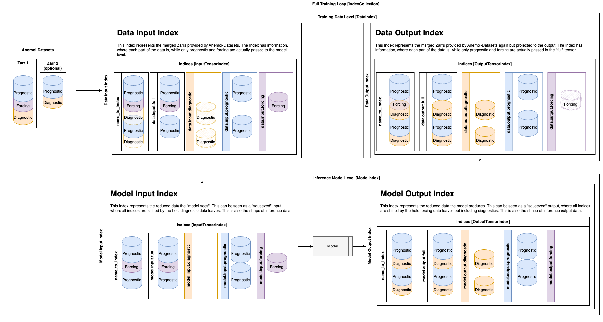

##############
 Data Indices
##############

Data routing with a DataIndex system that knows where data is passed based on config entries.

This documentation aims to first explain the user side (configs), and then goes into detail for developers.

Good news first: You don't need to know the index of data in your Zarr

*************
 Usage Information
*************

The routing information can be changed in the config in data.

There are currently three types of data with respect to the model:

- Prognostic: Data that is input into and output from the model
- Forcing: Data that informs the model as auxiliary information but isn't output nor fed to the loss
- Diagnostic: Data that is not input into the model, but is produced in the inference. (It's pseudo-diagnostic, as it is fed to the loss during training, so the model is still conditioned on this data.)

The default in Anemoi Models is that data is prognostic. But data can be switched to forcing or diagnostic by adding the value to the existing config entry:

.. code-block:: yaml

    data:
      forcing:
        - "lsm"
        - "sdor"
      diagnostic:
        - "tp"
        - "cp"

The are two Index-levels:

- Data: The data at "Zarr"-level provided by Anemoi-Datasets
- Model: The "squeezed" tensors with irrelevant parts missing.

These are both split into two versions:

- Input: The data going into training / model
- Output: The data produced by training / model

Each of these four indices has four integer Tensors available to slice into the data:

- full: The indices of all "relevant" data, i.e. prognostic and forcing for the input data.
- diagnostic: The indices for data that is "output only" and not fed to the model.
- prognostic: The indices for data that is in both the input and output for the training and model.
- forcing: The indices for data that is only input into the model but doesn't exist in the forecast state.

The data can be accessed via dot notation in such a way that:

.. code-block:: python

   data_indices.<model/data>.<input/output>.<full/diagnostic/prognostic/forcing>

Examples:

.. code-block:: python

    data_indices.data.input.full
    data_indices.model.output.diagnostic

The name_to_index dictionary is available for each of the four indices, which provides a mapping from variable name to index at that level. These are useful for providing users an interface in the config that does not rely on the knowledge of index-locations in the data. Generally, hard-coded locations are to be avoided.

*************
 Index Collections
*************

The Index Collections module provides a collection of indices, which are used to index and slice the data.

.. automodule:: anemoi.models.data_indices.collection
   :members:
   :no-undoc-members:
   :show-inheritance:

*************
 Index
*************

The Index module provides all data indices and methods for indexing and slicing the data.

.. automodule:: anemoi.models.data_indices.index
   :members:
   :no-undoc-members:
   :show-inheritance:

*************
 Tensor
*************

This provides the underlying data structure for the indices. It creates a tensor of the appropriate size and shape, and provides methods for indexing and slicing the data.

.. automodule:: anemoi.models.data_indices.tensor
   :members:
   :no-undoc-members:
   :show-inheritance:
