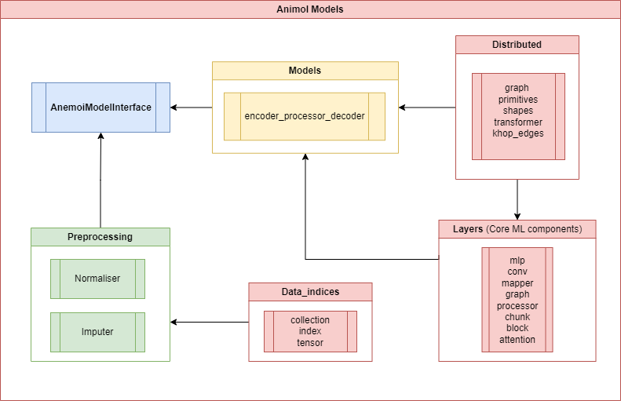

##########
 Overview
##########

Anemoi is a comprehensive framework designed to streamline the
development of machine learning models for data-driven weather
forecasting. The anemoi-models package lies at the core of this
framework, providing core components to train graph neural networks
(GNNs), including graph transformers for data-driven weather
forecasting.

The anemoi-models package has the following dependencies in the code:

Below is a detailed breakdown of these main components within the
anemoi-models package:

***********
 Interface
***********

The `AnemoiModelInterface` is designed to provide an interface between
the training and the model itself. This code is used for making
predictions with an underlying machine learning model. It implements the
the interface for pre-processing input data, performing inference using
the model, and post-processing the output.

These components can be extended and switched out with the config files.

This modular approach allows for easy customization and extension,
facilitating the use of different models and processors as needed.

***************
 Preprocessing
***************

The `preprocessing` module provides a set of tools and utilities for
preprocessing input data for the model. This includes normalizing the
input data and different imputation methods. The preprocessing module is
designed to be flexible and modular, allowing for easy customization and
extension.

This is achieved through a config that can provide a list of
preprocessing steps to be applied to the input data.

Currently the package includes the following preprocessing steps:

-  Normalization
-  Imputation

*******
 Model
*******

The `models` is the core component of the anemoi-models package,
defining the core model architecture for the graph neural network. The
model is designed to be flexible and modular, allowing for easy
customization and extension. The model is built using the PyTorch
Geometric library, which provides a wide range of tools and utilities
for building graph neural networks.

The model is designed to take in a graph representation of the input
data, process it using a series of modules, and output a prediction.

Currently the package includes the following models:

-  Encoder-Processor-Decoder architecture

********
 Layers
********

The `layers` module provides the core building blocks for the graph
neural network in `Models`. This includes graph transformers, graph
convolutions, and transformers, as well as, other layers that are used
to process the input data.

The layers are designed as extensible classes to allow for easy
experimentation and switching out of components.

The layers implement `Mappers`, which can encode and decode data from
the graph representation. The `Mappers` are used to process the input
data and output the prediction. The `Mappers` use the `Blocks` to
process the data, which are the building blocks of the graph neural
network.

Additionally, the layers implement `Processors` which are used to
process the data in the graph representation. The `Processors` use a
chunking strategy with `Chunks` that pass a subset of layers to `Blocks`
to allow for more efficient processing of the data.

Currently the package includes the following implementations:

-  Graph Convolution (Mapper, Processor)
-  Graph Transformer (Mapper, Processor)
-  Transformer (Processor)

**************
 Data Indices
**************

Throughout *anemoi models* and *anemoi training* we use the concept of
data indices to refer to the indices of the data and provide of the full
training data.

Specifically, this enables data routing of variables that are only used
as `forcing` variables in the input to the model, `diagnostic` which is
only an output of the model, and `prognostic` variables that are both
present in the input and the output.

*************
 Distributed
*************

The `distributed` module provides utilities for distributed training of
the model. This includes includes the splitting and gathering of the
model and its tensors / parameters across multiple GPUs. This process is
also known as "model shardings".
